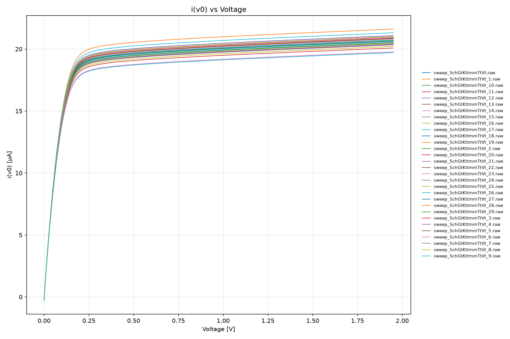

# Who
Nicolas Pfefferle

# Why

Out of curiosity, looking at the benefits of using a cascode current mirror versus the very simple one from the first tutorial exercise.

# How

sky130a pdk, xschem for schematic, magic vlsi for layout, ngspice for simulations. CICSIM and Python for ploting current distributions.

# What

| What            |        Cell/Name |
| :-              |  :-:       |
| Schematic       | design/JNW_EXA_SKY130A/JNW_EXA.sch |
| Layout          | design/JNW_EXA_SKY130A/JNW_EXA.mag |

# Changelog/Plan

| Version | Status | Comment|
| :---| :---| :---|
|0.1.0 | :X: | Using JNWATR_NCH_12C5F0 NFET |

# Signal interface

| Signal       | Direction | Domain  | Description           |
| :---         | :---:     | :---:   | :---:                 |
| IBP          | Input     | 1.95V   | Current mirror input  |
| IBN          | Output    | 1.95V   | Current mirror output |
| VSS          | Input     | Ground  |                       |

# Key parameters

| Parameter           | Min     | Typ           | Max     | Unit  |
| :---                | :---:     | :---:           | :---:     | :---: |
| Technology          |         | Skywater 130 nm |         |       |
| AVDD                | 1.7    | 1.8           | 1.9    | V     |
| Temperature         | -40     | 27            | 125     | C     |

### Cascode current mirror investigations.

#### Specification

| Parameter | Value | Unit | 
| --------- | ----- | ---- | 
| Iin | 20 | uA |
| Iout | 20 | uA |
| Vout | 0 - 1.95 | V |
| Accuracy Vout=0.8-1.95  | 1  | %    |

Using transistors `JNWATR_NCH_12CF0` with a channel length of `6um`.

Sweeping Vout from 0 to 1.95V current matching looks like this:

Sweeping Vout from 0 to 1.95V current matching looks like this:

Global distribution statistics
Condition: x_V >= 0.4 V

| metric | value    |
|--------|----------|
| count  | 3480     |
| mean   | 20.3028  |
| std    | 0.461958 |
| min    | 18.9824  |
| 1%     | 19.1349  |
| 5%     | 19.4998  |
| 50%    | 20.3186  |
| 95%    | 21.0011  |
| 99%    | 21.3982  |
| max    | 21.6214  |

Simulation parameters: `mc 30 loops` - see [sweep.spi](../../sim/JNW_EXA/sweep.spi).

### Next steps

To make the current matching even better, a longer channel 

